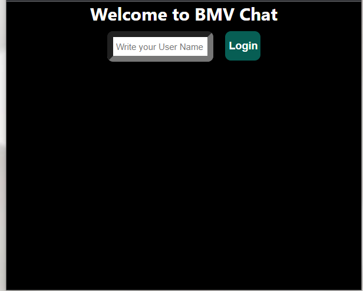

## React Chat app

## Overview
  - This is a simple chat application.

## Features
  - Real-time communication between clients and server using Socket.io
  - Real-time communication between users.

## Technologies Used
  - ReactJS - JavaScript library for building user interfaces
  - Material ui - For designing
  - Ant Design - For designing
  - Socket.io - Real-time communication library
  - Node.js - JavaScript runtime environment
  - Express - Web application framework for Node.js
  - Firebase - For storage chat message.

## Getting Started
  - Clone the repository: <code>git clone git@github.com:systemintegration/react-js-chat.git</code>
  - Navigate to the client folder and install the required dependencies:
      - <code>cd client</code>
      - <code>npm install</code>
  - Navigate to the server folder and install the required dependencies:
      - <code>cd server</code>
      - <code>npm install</code>
  - Start the server by navigating to the server folder and running the following command:
      - <code>node app.ts</code>
  - Start the client by navigating to the client folder and running the following command:
      - <code>npm start</code>
  - Open your browser and go to http://localhost:3000 to access the application.

## Setup Firebase account for storage.
  - Login to your firebase google account
  - Click on <b>Get started</b> button, after that click on <b>Create a project</b>.
  - FillUp all the details of your project, when you finished them click on continue button.
  - Create Cloud Fire store.
  - For add details on firebase.ts file you can click on project overview's left side button (setting).
      - Add apps information of your project and add all the details.
      - Copy Firebase SDK from the details.

## Contributing
  - Contributions are welcome! To contribute to the project, follow these steps:
    - Fork the repository
    - Create a new branch: <code>git checkout -b my-feature-branch</code>
    - Make your changes and commit them: <code>git commit -am 'Add some feature'</code>
    - Push your changes to your branch: <code>git push origin my-feature-branch</code>
    - Create a new pull request and explain your changes
In the project directory, you can run:

## Screenshots
  User Login page when run the script.

  

  When user login from two different browsers

  

  User chat page.

  

## Demo
   - You can try out the application at <a href="https://systemintegration.github.io/react-js-chat">https://systemintegration.github.io/react-js-chat</a>
